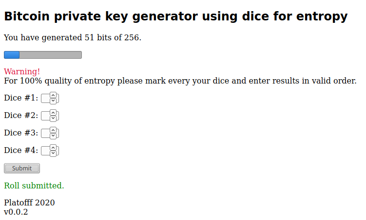

# Deicecoin
Bitcoin private key generator using 6-side dice (up to 4 cubes) for entropy. There is only one html file, you need just some modern browser to run it.

For me the generation takes 15 minutes with 4 cubes.

Private key format is **compressed WIF**.

## License: MIT